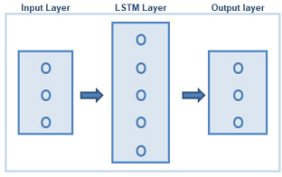
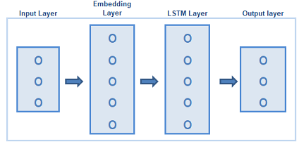
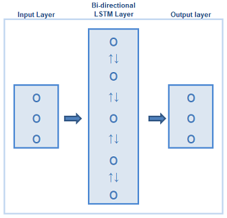
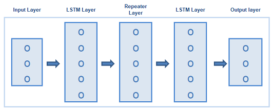
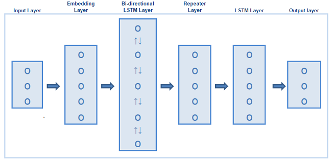

# Introduction
Here I discuss building a language translation system to translate English sentences to French. I developed the system using Recurrent Neural Networks (RNN) with the keras api.  Completion of this project was a requirement for Udacity’s program [Artificial Intelligence Nanodegree (AIND) and Specializations.](https://confirm.udacity.com/GGGH2GSK)

# Project Instructions
The goal of the project is to build an end-to-end machine translation pipeline that will accept English text and return the French translation.  The project is divided into three sections:
1.	Preprocess – Tokenize all the words (English and French) into integer ids and add padding to make all sentences the same length.
2.	Create models – Create four RNN models where each one incorporates the following architectures: i) a simple RNN, ii) an RNN with an embedding layer, iii) an RNN with a bidirectional layer and iv) an encoder-decoder RNN structure.  At the end we need to create one model that will outperform all of the four models.
3.	Make Predictions – Using the final model we make predictions on the testing data set.

# What is Machine Translation?
Machine translation (MT) can be described as the ability of a computer to convert text from one language to another.  On the surface MT may seem like a straightforward process, but in reality it is highly complex.   Historically, two of the more popular approaches to solving MT were rule-based and statistical translation.  However, it was not until the advent of machine learning and RNN that MT achieved human level accuracy.  Exploring MT with RNN is the main focus of this project.

# Model Discussion and Results
The following section discusses the topology of each model and its performance.

## Simple Model

For the simple model, I used a long short-term memory [(LSTM)](https://en.wikipedia.org/wiki/Long_short-term_memory) layer and a fully connected softmax output layer.  LSTMs are a type of RNN. A common LSTM unit is composed of a cell, an input gate, an output gate and a forget gate. The cell remembers values over arbitrary time intervals and the three gates regulate the flow of information into and out of the cell.  The simple model achieved an accuracy of 67% on the test dataset.

## Embedding Model

In this model I used three layers; embedding layer, LSTM and a fully connected softmax output layer.
An [embedding layer]( https://machinelearningmastery.com/what-are-word-embeddings/) is a vector of words that allows words with similar meaning to have a similar representation. The embedding model achieved an accuracy of 93% on the test dataset.

## Bidirectional Model

In this model I used two layers; a bidirectional LSTM layer and a fully connected softmax output layer.
[Bidirectional LSTMs]( https://machinelearningmastery.com/develop-bidirectional-lstm-sequence-classification-python-keras/) train two instead of one LSTM on the input sequence. The first on the input sequence as-is and the second on a reversed copy of the input sequence.  The bidirectional model achieved an accuracy of 69% on the test dataset.

## Encoder-Decoder Model

In this model I used four layers; a LSTM layer, repeater layer, second LSTM layer and fully connected softmax output layer.
An [Encoder-Decoder](https://machinelearningmastery.com/encoder-decoder-long-short-term-memory-networks/) model is a RNN model designed to perform sequence-to-sequence predictions.  In this architecture we have two models that functions as one.  One part of the model reads the input data and the other decodes and outputs a prediction. The Encoder-Decoder model achieved an accuracy of 62% on the test dataset.

## Final Model 

For the final model I combined all the best components of the previous four models and created one super model.  
The final model is an encoder-decoder architecture with an Embedding layer and encoder layer that is Bidirectional.  This final model achieved an accuracy of 98%.
